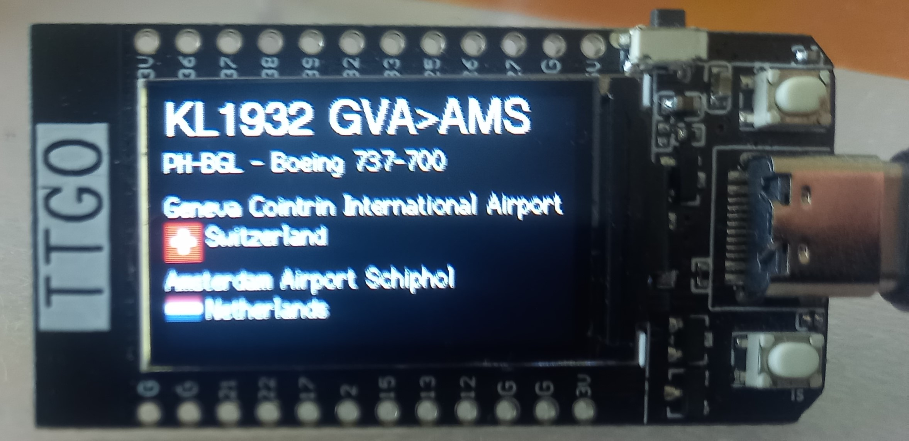

# FlightRadar24-TTGO

Display flights in your area and display them on the screen of the ESP32 TTGO-Display module.
Under the hood it uses the API of [FlightRadar24.com](https://www.flightradar24.com/).

This application loads the flights near you (defined in the file .settings.h) and displays them sequentially on the display.

### Features
- Lookup of airplane type
- Lookup of the full name for airports
- Lookup and display flag for the countries
- No account required

## Usage
Download the repo, open it in [**PlatformIO**](https://platformio.org/) and flash it to the ESP32-TTGO-Display.
**Copy the file settings.h to .settings.h to keep your settings secret.**
This file is by default (on purpose) not present and a compiler error is generated!

## Installing and running PlatformIO

- Install Visual Studio Code
- From the Extensions menu select PlatformIo
- Clone this repository, and open the folder in your workspace
- Make a copy of the file settings.h named .setting.h (not the dot in front). This will be **your** private configuration file.
- Enter the SSID and password in the .settings file to connect to WiFi
- Enter the GPS coordinates of the location to monitor and range in the .settings file
- Compile and upload to the ESP32-TTGO-Display
- Enjoy!

## Credits
Thanks to [FlightRadar24.com](https://www.flightradar24.com/) to be able to hook into their API.
