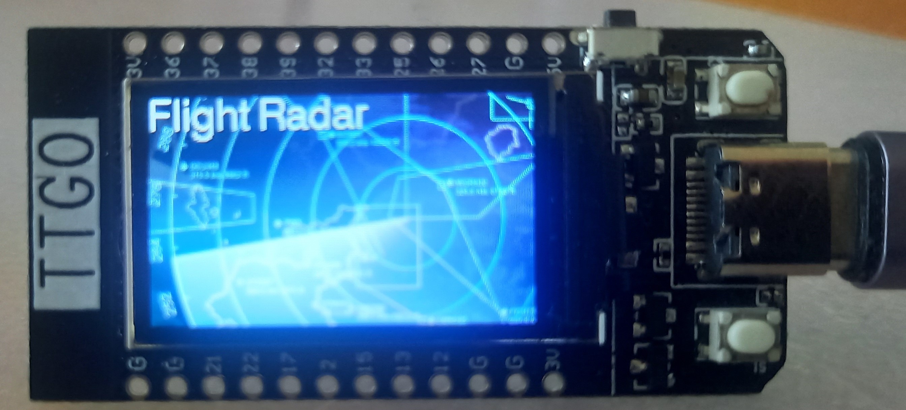
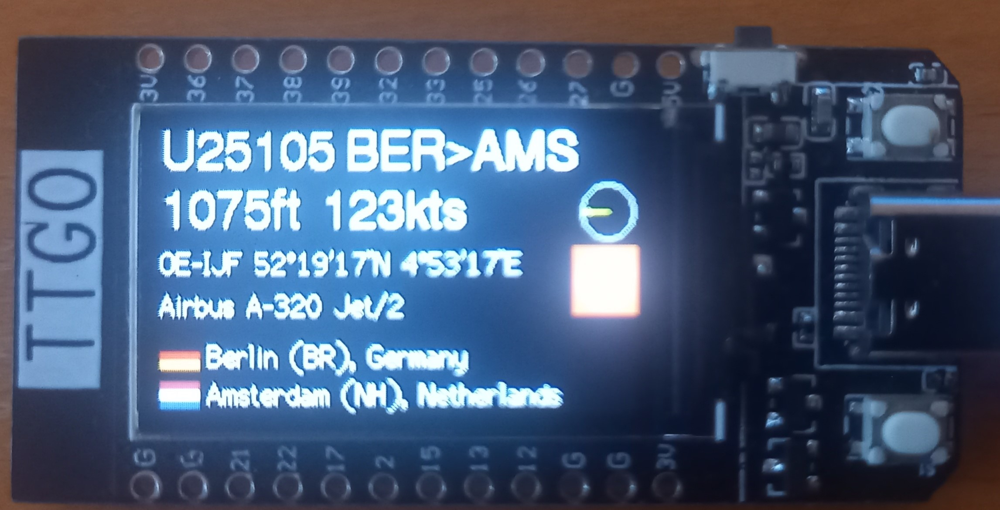
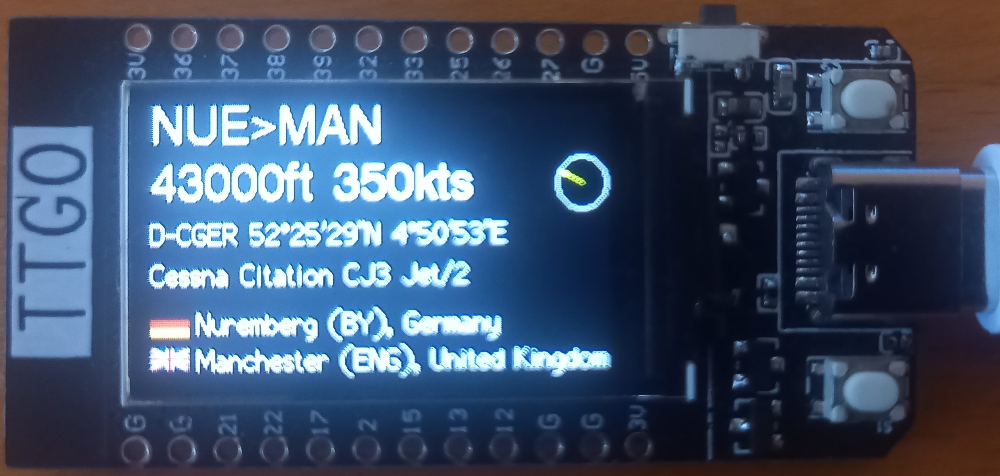

# FlightRadar24-TTGO

Display flights in your area and display them on the screen of the ESP32 TTGO-Display module.
Under the hood it uses the API of [FlightRadar24.com](https://www.flightradar24.com/).

This application loads the flights near you (defined in the file .settings.h) and displays them sequentially on the display.

### Features
- Lookup of airplane type and specifics
- Lookup of carrier and display the logo
- Display GPS location, registration,  altitude and speed of the airplan
- Lookup of the full name for the from- and to airports name and region, lat/lon
- Lookup and display flag for the countries
- No account required

## Usage
Download the repo, open it in [**PlatformIO**](https://platformio.org/) and flash it to the ESP32-TTGO-Display.

## Installing and running PlatformIO

- Install Visual Studio Code
- From the Extensions menu select PlatformIo
- Clone this repository, and open the folder in your workspace
- Compile and upload to the ESP32-TTGO-Display
- When starting you can connect using Wifi to the SSID: FlightRadar (no password). Here you can:
    - Set the name for the Thing name (Wifi SSID) and password for changing the configuration,
    - Set the SSID and password for the network to connect to with internet access,
    - Set the latitude and longitude (decimal format) to observe,
    - Set the timezone.
- When done disconnect / reset the device and wait till the connection is made with the network
- Enjoy!

## Modifying the configuration
- When booting, the device waits 30 seconds for a connection. Make a connection to the SSID indicated on the screen using the AP password.
- When connected, go to the ip of the device and, when prompted for the credentials, enter 'admin' and the AP password.
- When the password is lost, a quick fix is to change the CONFIG_VERSION constant and flash the device. This will reset the configuration.

## Case
Please take a look at the STL file to create a case for the flightradar to host the TTGO Display and a battery. Files can be found at [Thingverse](https://www.thingiverse.com/thing:5412296/files). Thanks to Erwin Reid for creating the models.

## Credits
Thanks to [FlightRadar24.com](https://www.flightradar24.com/) to be able to hook into their API.
