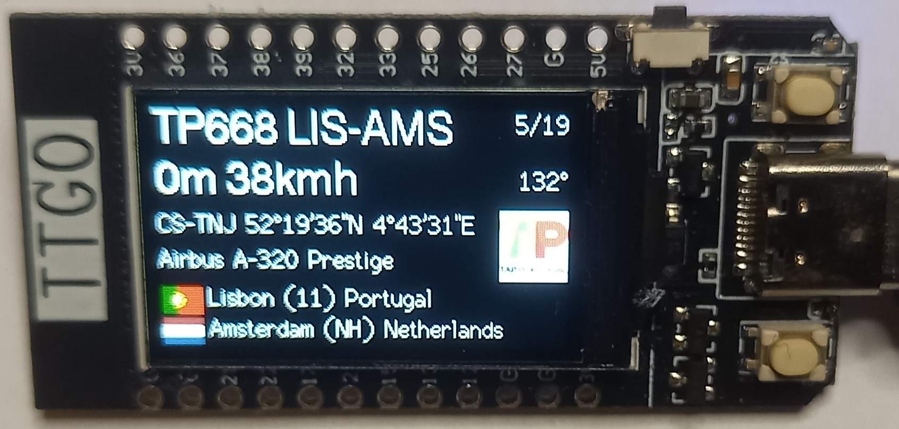
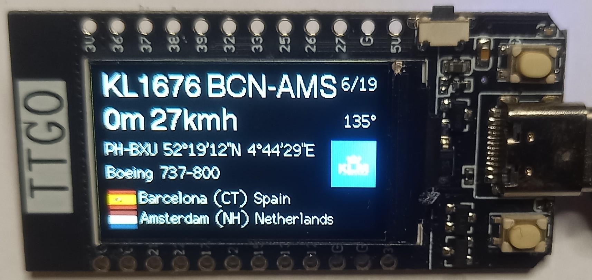
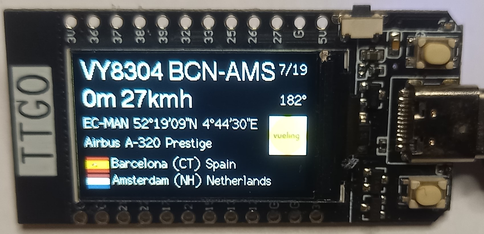
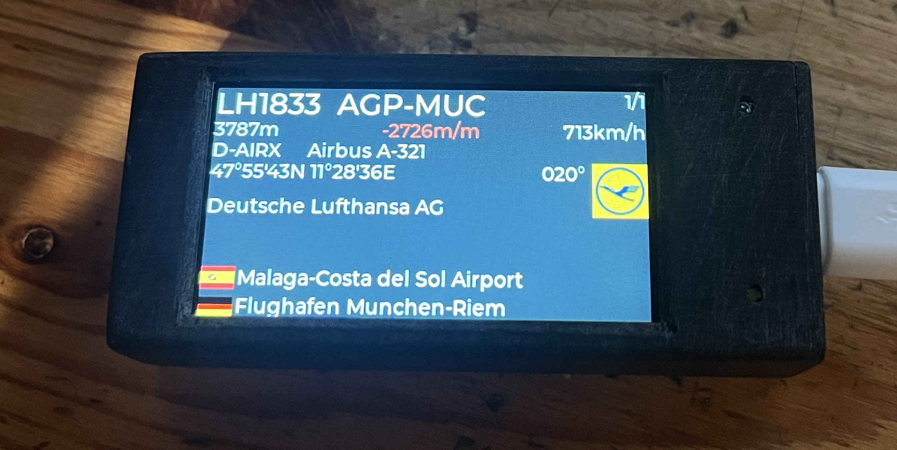
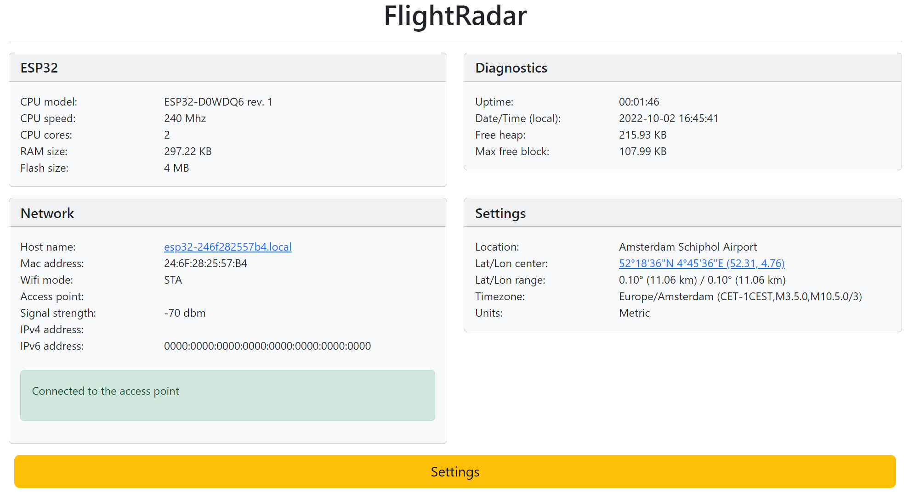
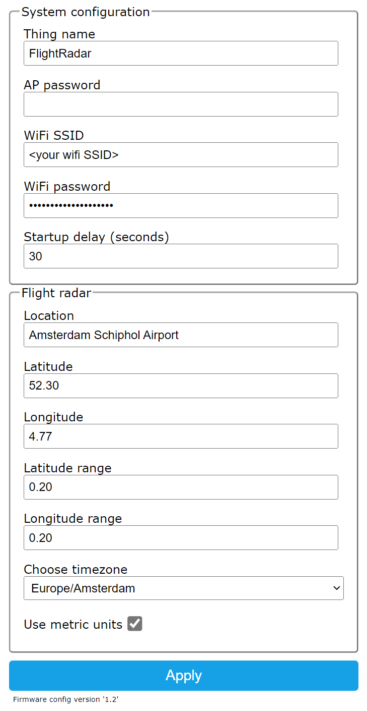
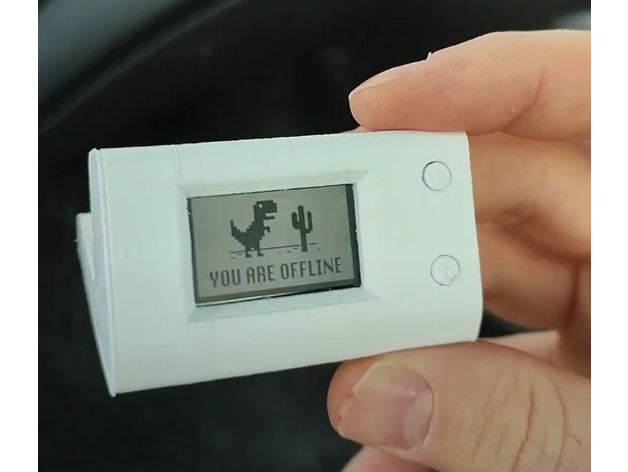
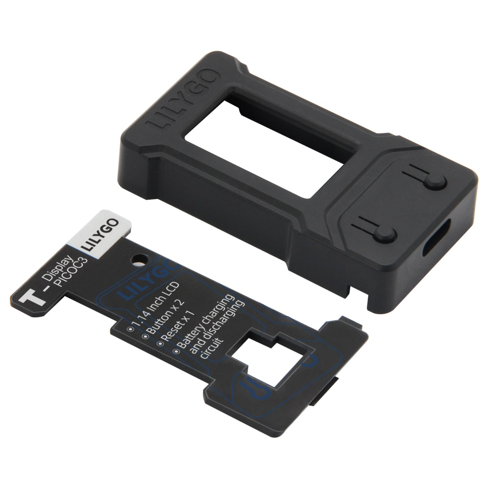

# FlightRadar24-TTGO

[](https://github.com/rzeldent/esp32-flightradar24-ttgo/actions/workflows/main.yml)
[](https://github.com/rzeldent/esp32-flightradar24-ttgo/releases)
[](https://platformio.org/)
[](https://lvgl.io/)

Real-time flights display. No login or account required.
Easy configuration through the web interface.



Display flights in your area and display them on the screen of the ESP32 TTGO-Display or LilyGo-T-Display-S3 module.
Under the hood it uses the API of [FlightRadar24.com](https://www.flightradar24.com/) but only for flight updates.
Internally there is a database with airport, aircraft and airline data with graphics to minimize the requests.

This application retrieves the current flights near a configured location and displays them sequentially on the display.




Example of layout on LilyGo-T-Display-S3


## Table of Contents

- [History](#history)
- [Features](#features)
- [Prerequisites](#prerequisites)
- [Getting Started](#getting-started)
- [Project structure](#project-structure)
- [Status overview](#status-overview)
- [Configuration](#modifying-the-configuration)
- [Case / Enclosure](#case--enclosure)
- [Suggestions](#suggestions)
- [Credits](#credits)

## History

|             |                                                                      |
| :---------- | :------------------------------------------------------------------- |
| Aug 25 2026 | Fixed display issues with updating, new logo, removed scrollbar      |
| Jan 10 2026 | Optimized data tables                                                |
| Jan 4 2026  | Created build / release script                                       |
| Oct 21 2023 | Added configuration from LilyGo-T-Display-S3 with help from ulihuber |
| Oct 25 2022 | Use LVGL for graphics                                                |
| Oct 15 2022 | Filtering for airborne/grounded/gliders/vehicles                     |
| Oct 14 2022 | Added vertical speed                                                 |
| Oct 2 2022  | Bootstrap for HTML overview                                          |
| Jun 16 2022 | Wifi manager for configuration                                       |
| Jun 15 2022 | Use time zones                                                       |
| Apr 27 2022 | Import aircraft types                                                |
| Dec 5 2021  | Compressing of RGB565                                                |
| Nov 21 2021 | Import airlines from Wiki page                                       |
| Nov 8 2021  | New airline logos                                                    |
| Oct 31 2021 | Added heading, altitude and speed                                    |
| Oct 6 2021  | Move images from SPIFF to code                                       |
| May 25 2021 | GUI update                                                           |
| Dec 26 2019 | Initial version: The "birth" of the project                          |

## Features

The FlightRadar firmware offers the following features:

- Lookup of airplane type and specifics (manufacturer, type, description, engine type and count)
- Lookup of carrier and (if available) display the logo
- Display GPS location, registration, altitude, heading, speed and vertical speed of the airplane
- Lookup of the full name for the from- and to airports name and region, lat/lon
- Lookup and display flag for the countries
- No account required, only WiFi with internet connection!
- Minimal interaction with FlightRadar24; database and graphics are present in firmware
- Configuration using a Web interface
- HTML status screen
- Stay in AP mode at reset (Resetting + pressing top button)

## Prerequisites

- **Hardware**: ESP32 TTGO-Display or LilyGo-T-Display-S3
- **Software**: [Visual Studio Code](https://code.visualstudio.com/) with the [PlatformIO](https://platformio.org/) extension

## Getting Started

1. Clone the repository:
   ```
   git clone https://github.com/rzeldent/esp32-flightradar24-ttgo.git
   ```
2. Open the folder in VS Code with the PlatformIO extension installed
3. Build the firmware:
   ```
   pio run
   ```
4. Flash to the device:
   ```
   pio run -t upload
   ```
5. Watch the serial output:
   ```
   pio run -t monitor
   ```
6. Erase the flash for a full reset (also clears the configuration):
   ```
   pio run -t erase
   ```

On first boot, connect to the WiFi access point `FlightRadar` and configure your network credentials.
After configuration the device starts updating the flights in the configured area.

## Project structure

- `src/` – firmware source (`main.cpp`, flights, airlines, airports, countries)
- `include/` – generated headers and lookup tables (aircraft, airline logos, country flags, images, settings)
- `html/` – embedded web configuration page
- `assets/` – screenshots used in this README
- `generate_images.ps1` / `generate_images.sh` / `images_to_lvgl.py` – logo, flag and image generation pipeline

## Status overview

When connected to the FlightRadar, the main screen is shown; the overview.
Here details about the device, network and settings are shown.


## Modifying the configuration

The configuration can be changed using a web browser. Connecting to the flight radar can be done in two ways:

- During startup, connect to the access point `FlightRadar` and log in. In case the browser does not open the page immediately, the url is [http://192.168.4.1](http://192.168.4.1).
- Find the internal IP address of the FlightRadar (from your home router) and enter the url.
- When the password is lost, a fix is to completely erase the ESP32 using the `pio run -t erase` command.
  This will reset the device including configuration.
  If using the esptool, you can do this using `esptool.py --chip esp32 --port /dev/ttyUSB0 erase_flash`.
  However, after erasing, reflashing of the firmware is required.



### Configuration options

| Option                       | Description                                     |
| ---------------------------- | ----------------------------------------------- |
| WIFI SSID / password         | Credentials for changing the configuration      |
| SSID / password (network)    | Network to connect to for internet access       |
| Latitude / longitude         | Position (decimal format) to observe            |
| Range (lat / lon)            | Area to observe, in degrees                     |
| Include airborne             | Filter: show airborne flights                   |
| Include grounded             | Filter: show grounded flights                   |
| Include gliders              | Filter: show gliders                            |
| Include vehicles             | Filter: show vehicles on the ground             |
| Timezone                     | Time zone for time and date display             |
| Metric units                 | Use metric or imperial units                    |

### Tips

- Sometimes after configuration a reboot is required.
  If the error screen is shown that it is unable to make a connection, first try to reboot the device,
- When booting, the device waits 30 seconds for a connection.
  Make a connection to the SSID indicated on the screen using the AP password,
- When connected, go to the ip of the device and, when prompted for the credentials, enter 'admin' and the AP password.
  This field is **required** before saving the credentials,
- When the password is lost, holding the top button while booting will clear the configuration.
- When finished disconnect from the wireless network. This should reset the flight radar.
  Resetting is also a good alternative...

## Case / Enclosure

Please take a look at the STL file to create a case for the FlightRadar to host the TTGO-Display and a battery.
Thanks to Erwin Reid for creating the models.

Files can be found at [Thingiverse](https://www.thingiverse.com/thing:5412296/files).



Another option is from LilyGo (AliExpress).
With a little modification, the "LILYGO® T-Display Shell ABS Accessories For T-Display T-PicoC3 T-Display RP2040" can be adapted by removing the stands in the case.

These can be ordered at [https://www.aliexpress.com/item/1005004507656890.html](https://www.aliexpress.com/item/1005004507656890.html)



## Suggestions

Suggestions especially to faulty or missing logos, airlines etc are welcome. Please make a Pull request and, after verification, this will be added to the main version.

## Credits

Thanks to [FlightRadar24.com](https://www.flightradar24.com/) to be able to hook into their API.
