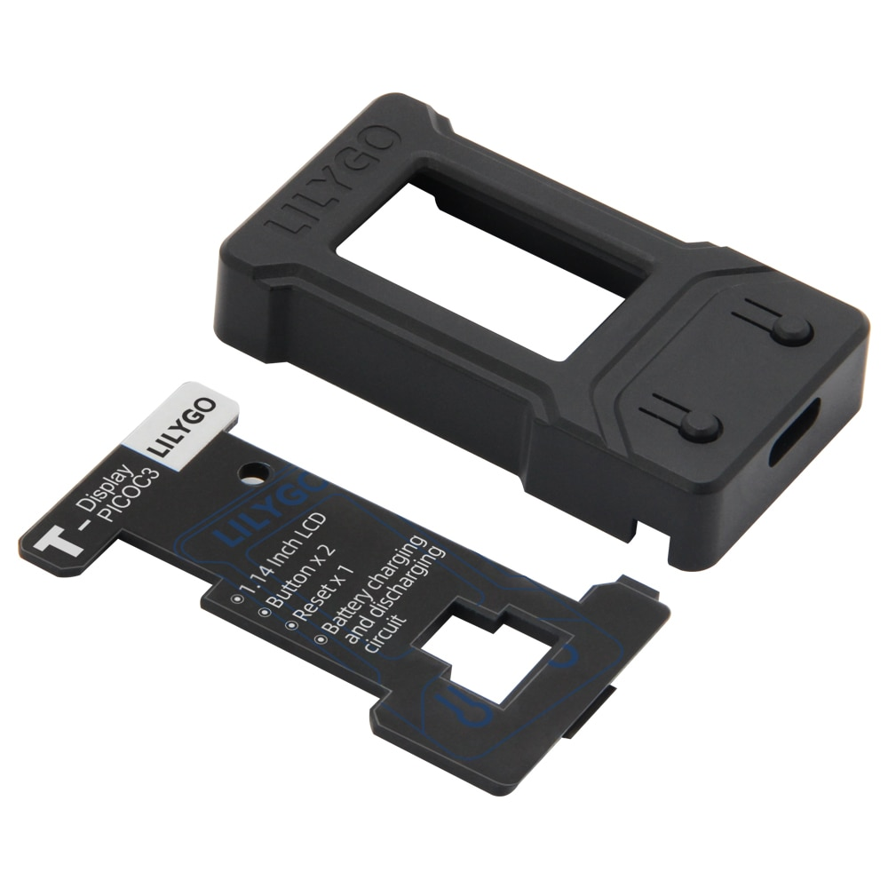

# FlightRadar24-TTGO


Real-time flights display. No login or account required.
Easy configuration through the web interface.


Display flights in your area and display them on the screen of the ESP32 TTGO-Display module.
Under the hood it uses the API of [FlightRadar24.com](https://www.flightradar24.com/) but only for flight updates.
Internally there is a database with airport, aircraft and airline data with graphics to minimize the requests.

This application retrieves the current flights near a configured location and displays them sequentially on the display.


### Features
The flight radar offers the following features:
- Lookup of airplane type and specifics (manufacturer, type, description, engine type and count)
- Lookup of carrier and (if available) display the logo
- Display GPS location, registration,  altitude, heading and speed of the airplane
- Lookup of the full name for the from- and to airports name and region, lat/lon
- Lookup and display flag for the countries
- No account required!

## Usage
Download the repo, open it in [**PlatformIO**](https://platformio.org/) and flash it to the ESP32-TTGO-Display.

## Installing and running PlatformIO
Take the following steps to install platformIo. There is a lot of information on their site!
- Install Visual Studio Code
- From the Extensions menu select PlatformIo
- Clone this repository, and open the folder in your workspace
- Compile and upload to the ESP32-TTGO-Display

## Status overview
When connected to the flightradar, the main screen is shown; the overview.
Here details about the device, network and settings are shown.


## Modifying the configuration
The configuration can be changed using a web browser. Connecting to the flight radar can be done in two ways:
- During startup, connect to the access point ```FlightRadar``` and log in. In case the browser does not open the page immediately, the url is [http://192.168.4.1](http://192.168.4.1).
- Find the internal IP address of the flightradar (from your home router) and enter the url.


Configuration options:
- The name for the Thing name (WiFi SSID) and password for changing the configuration,
- The SSID and password for the network to connect to with internet access,
- The latitude and longitude (decimal format) to observe,
- The timezone,
- Usage of metric or imperial units

Some tips:
- Sometimes after configuration a reboot is required. If the error screen is shown that it is unable to make a connection, first try to reboot the device,
- When booting, the device waits 30 seconds for a connection. Make a connection to the SSID indicated on the screen using the AP password,
- When connected, go to the ip of the device and, when prompted for the credentials, enter 'admin' and the AP password. This field is **required** before saving the credentials,
- When the password is lost, a fix is to completely erase the ESP32 using the ```pio run -t erase``` command. This will reset the device including configuration. Reflashing of the firmware is required.
- When finished disconnect from the wireless network. This should reset the flight radar. Resetting is also a good alternative...

## Case / Enclosure
Please take a look at the STL file to create a case for the flightradar to host the TTGO Display and a battery.
Thanks to Erwin Reid for creating the models.

Files can be found at [Thingverse](https://www.thingiverse.com/thing:5412296/files).


Another option is from LilyGo (AliExpress).
With a little modification, the "LILYGO® T-Display Shell ABS Accessories For T-Display T-PicoC3 T-Display RP2040" can be adapted by removing the stands in the case.

These can be ordered at [https://www.aliexpress.com/item/1005004507656890.html](https://www.aliexpress.com/item/1005004507656890.html)



## Suggestions
Suggestions especially to faulty or missing logo's, airlines etc are welcome. Please make a Pull request and, after verification, this will be added to the main version.

## Credits
Thanks to [FlightRadar24.com](https://www.flightradar24.com/) to be able to hook into their API.
